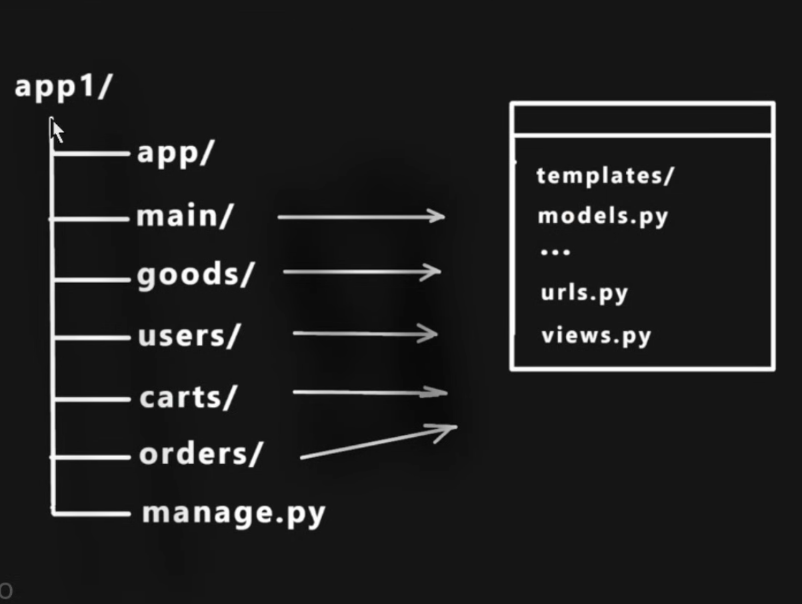
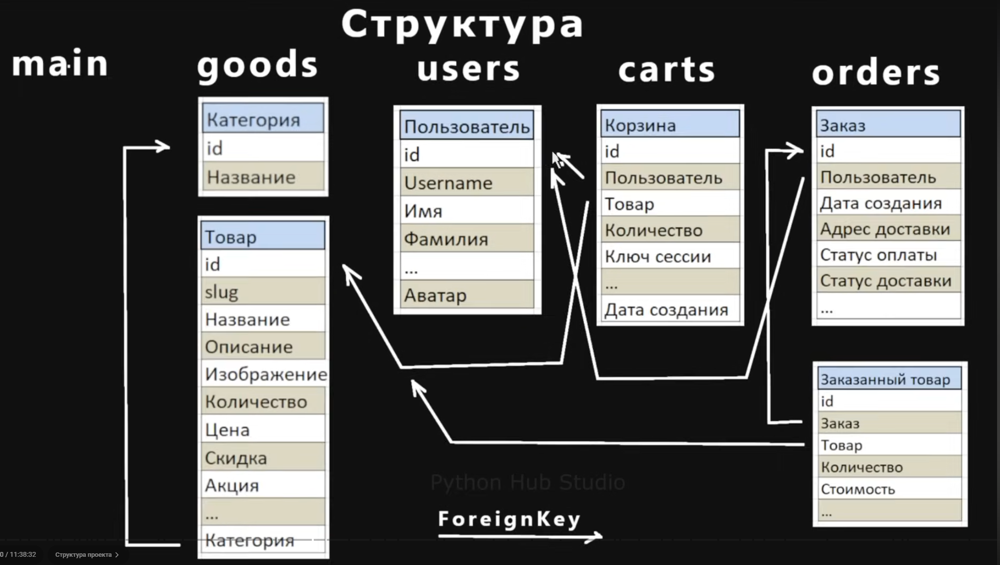

https://www.youtube.com/watch?v=w-ITLbRfhnA&list=PLNi5HdK6QEmWNqncVoUZtj1QDC2VV0wI6

# Версия Django Этого проекта django==4.2.
django==4.2.
pip install Pillow - Бля работы с изображением.
pip install django-debug-toolbar - Используем как расширение для Django

# Версия Python 3.11.9

# Структура папок.

storehome/
├── goods/
│   ├── templates/
│   │   └── goods/
│   │       └── catalog.html  # Шаблон страницы каталога товаров
│   ├── urls.py  # Маршруты приложения "goods"
│   └── views.py  # Представления для приложения "goods"
├── main/
│   ├── templates/
│   │   ├── main/
│   │   │   ├── about.html  # Шаблон страницы "О нас"
│   │   │   └── base.html  # Основной шаблон для всех страниц
│   ├── static/
│   │   └── deps/
│   │       ├── css/
│   │       │   └── my_footer_css.css  # CSS файл для подвала
│   │       └── icons/
│   │           ├── grid-fill.svg  # Иконка для каталога товаров
│   │           ├── basket2-fill.svg  # Иконка для корзины
│   └── views.py  # Представления для основного приложения "main"
├── manage.py  # Утилита для управления проектом
└── storehome/
    ├── __init__.py  # Мета-файл для пакета
    ├── settings.py  # Настройки проекта
    ├── urls.py  # Маршруты для всего проекта
    └── wsgi.py  # Стартовый файл для развертывания приложения WSGI

# Схема базы данных.
- Структура данных.

